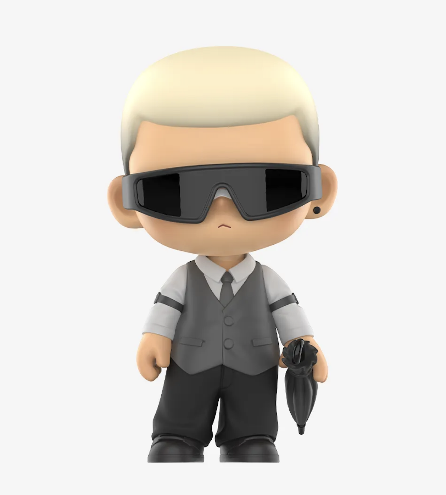
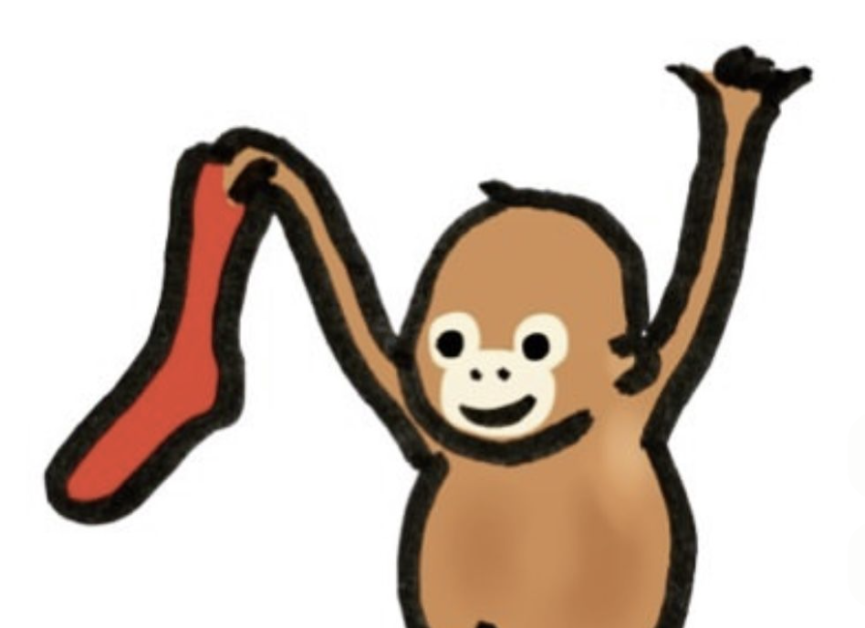
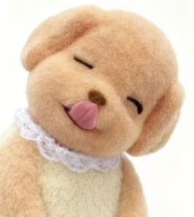
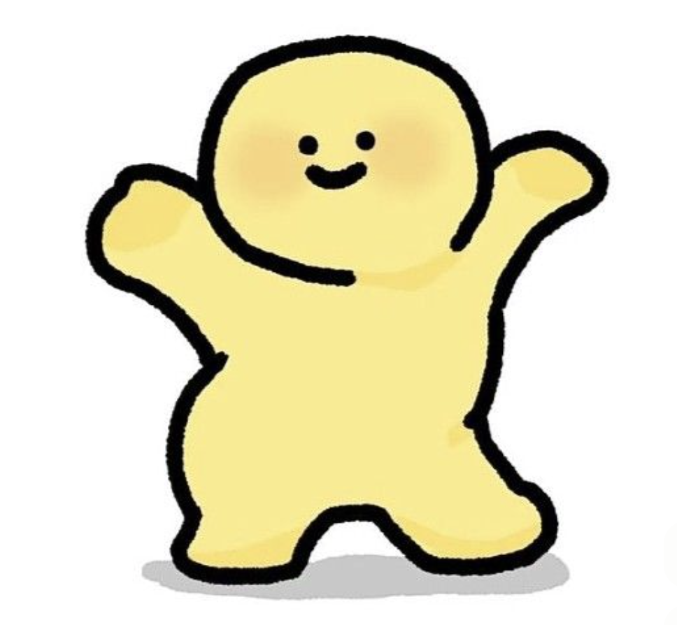

# **Fishtopia**

## **Meet Our Team !!**

### _Carson_

### **Tracy**

### **Nikka**

### **Runn**

### **Phil**

---

## **About the Project**

**Fishtopia** is a narrative-focused game design project about Finn, who becomes stranded on an island inhabited entirely by cats. After inheriting their grandfather’s fishing business, Finn must learn how to fish, upgrade equipment, and slowly become part of the island community.

## **For this project, I am applying and developing several skills:**

- **Game Systems Design:** Planning how fishing, upgrades, and progression work to make the gameplay balanced and meaningful.  
- **Worldbuilding:** Creating the island, the Kittezens community, and the story elements to support the themes of independence and small-town life.  
- **Research and Analysis:** Studying other life-simulation and fishing games to understand progression, pacing, and reward systems.  
- **Documentation:** Writing clear design documents that explain mechanics, upgrade tiers, and gameplay flow for future development.  
- **Critical Thinking and Problem Solving:** Figuring out how to make each gameplay element connect to the story and feel satisfying for players.

## **My Focus**

For this project, I want to focus on making the game feel real and immersive. I want players to feel like they are actually on the island with Finn, interacting with the Kittezens, fishing, and building their daily life. This means paying close attention to details like how fishing works and how the game feels alive.  
